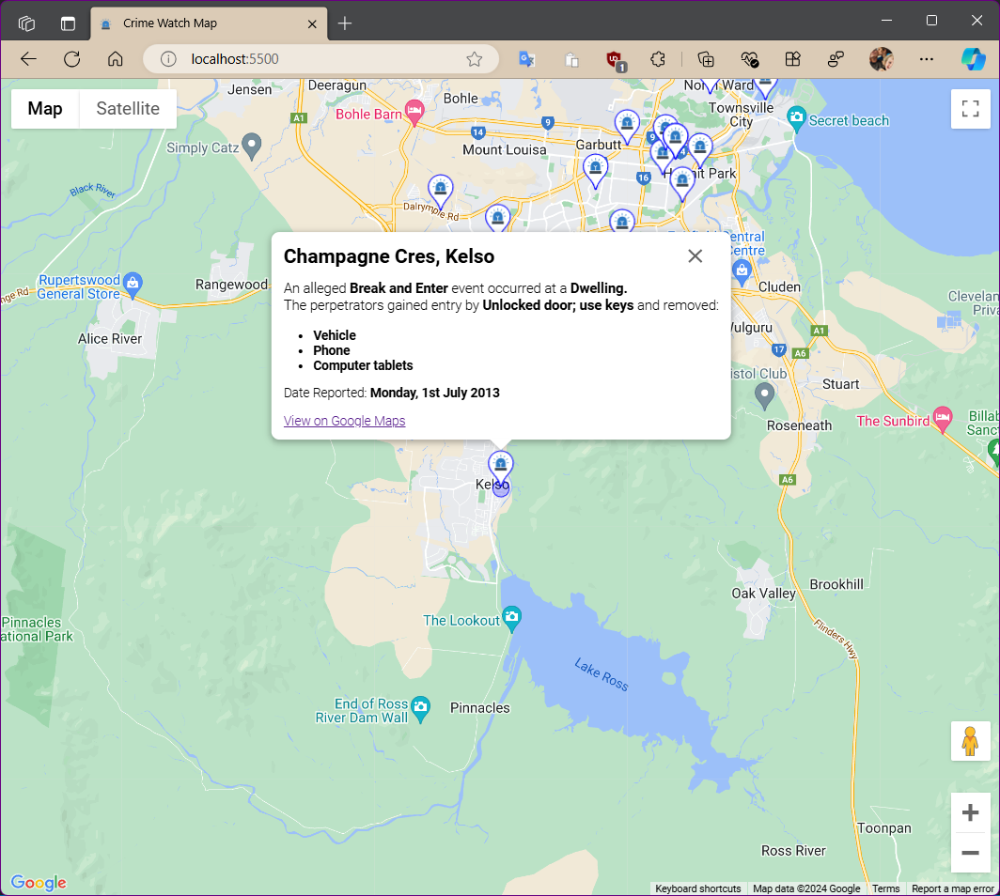
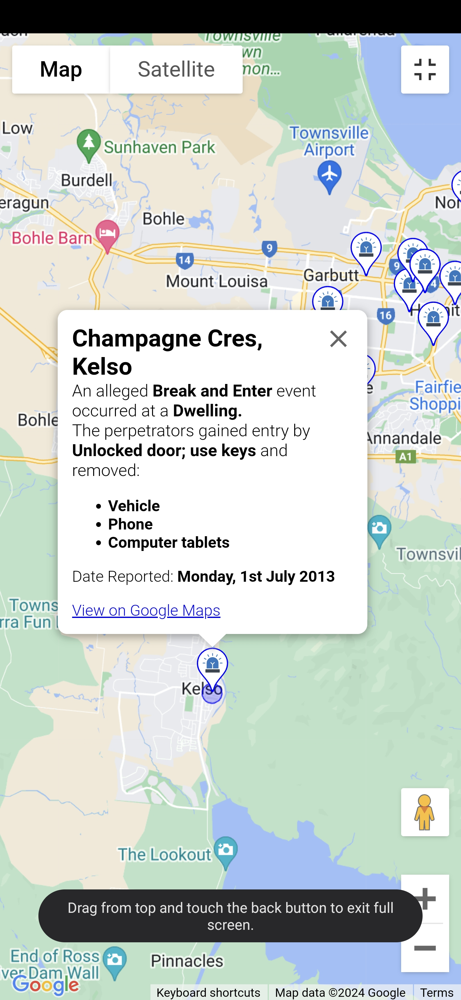

# Crime Busters Online Web based Application Upgrade
This is an upgrade of code I developed to show maps of crimes reported to police. This was used in local news paper website.

**Note: the code is no longer in use, and the crime acusations are old.**

> **A first in Australia!**


Back in the day, we worked with Queensland Police to send daily reports, In another stand alone application, I created `.xml` files based on dates of reports. 

They were uploaded to our website and this application was used.

## Notes
* Complete rewrite of code
* I have un-obfuscated my original code downloaded from Wayback Machine
* Upgrading to latest version of Google Maps API
* Upgraded to use HTML5 ES6 Modules

### Old Code Written by myself in 2010
I used multiple resources to find and download the HTML and related `.css`, `.js` as well as related images.

Ended up directly downloading the code, removing Wayback Machine code and links:
<https://web.archive.org/web/*/http://static.townsvillebulletin.com.au/crimebusters/*>

For Specific Date:
<https://web.archive.org/web/20111213050643if_/http://static.townsvillebulletin.com.au/crimebusters/#>

## Upgrade Notes:

### Error with outdated version:

From Edge DevTools Console:

```
Google Maps JavaScript API has been loaded directly without loading=async. 
This can result in suboptimal performance. For best-practice loading patterns please see https://goo.gle/js-api-loading 
```

```HTML
<script src="https://maps.googleapis.com/maps/api/js?key="" type="text/javascript"></script>
```
### I tried other ways to download old souce code:
First using different ways, but ended up simply downloading manually.

#### Bash Script

```bash
#!/bin/bash
url= "http://www.townsvillebulletin.com.au/crimebusters/" 
wget "http://web.archive.org/cdx/search/cdx?url=${url}*&output=json&fl=original,timestamp" -O out.json
sed -Eni '2,$s%^\["([^"]*)","([^"]*)"](,|])$%https://web.archive.org/web/\2id_/\1%gmp' out.json 
wget -i out.json
```
### Wayback Machine Downloader
> Source: https://github.com/hartator/wayback-machine-downloader

## Examples:

This was the application, using an `<IFRAME>` running on web browser:


The `<IFRAME>` source. Not all images downloaded and Google Maps outdated:


New version in browser:



Running on Android mobile phone:

Running full screen:

