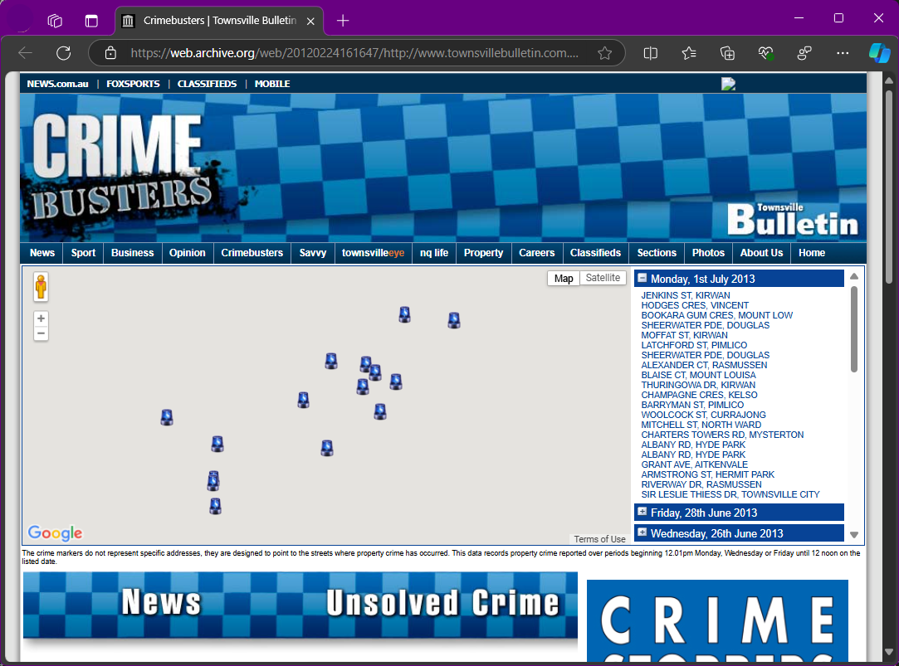
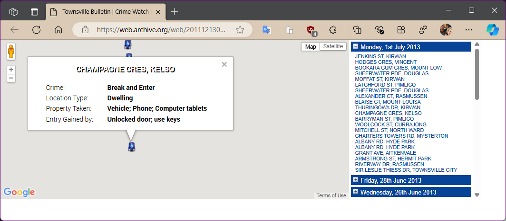
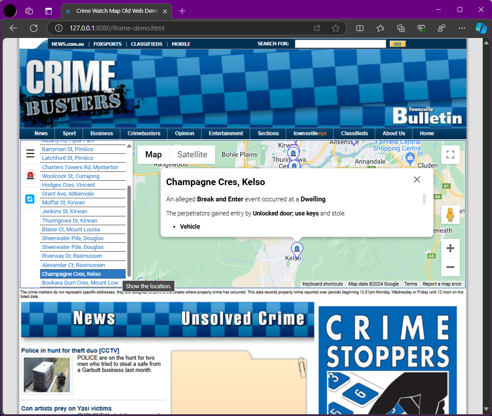

# Crime Busters Online Web based Application Upgrade
This is an upgrade of code I developed to show maps of crimes reported to police. This was used in local news paper website.

**Note: the code is no longer in use, and the crime events are old and unconfirmed!**

Back in the day, we worked with Queensland Police to send daily reports, In another stand alone application, I created `.xml` files based on dates of reports. 

This application was used to show reported events as markers using Google Maps API.

><br>**A first in Australia!**

## Notes
I created this to outline my skills, ability to upgrade old code without original source:

* Complete rewrite of old code.
* I un-obfuscated my original code downloaded from Wayback Machine.
* Upgrading to latest version of Google Maps API.
* Upgraded to use HTML5/ES6 Modules.
* Uses the Haversine formula to calculate the distance between two points on the Earth’s surface, sorts events listed, based on distance from map center. https://en.wikipedia.org/wiki/Haversine_formula
[Haversine Formula Copilot Conversation ](<The Haversine Formula.md>)

**No external JavaScript frameworks such as Angular or React where used.**

### Old Code Written by myself in 2010
<https://web.archive.org/web/20120224161647/http://www.townsvillebulletin.com.au/crimebusters/>

I used multiple resources to find and download the HTML and related `.css`, `.js` as well as related images.

Ended up directly downloading the code, removing Wayback Machine code and links:
<https://web.archive.org/web/*/http://static.townsvillebulletin.com.au/crimebusters/*>


For Specific Date:
<https://web.archive.org/web/20111213050643if_/http://static.townsvillebulletin.com.au/crimebusters/#>

## Upgrade Notes:

### Error with outdated version:

From Edge DevTools Console:

> Google Maps JavaScript API has been loaded directly without loading=async. 
This can result in suboptimal performance. For best-practice loading patterns please see https://goo.gle/js-api-loading 

Code was using:
```HTML
<script src="https://maps.googleapis.com/maps/api/js?key="" type="text/javascript"></script>
```
### I tried other ways to download old souce code:
First using different ways, but ended up simply downloading manually.

#### Bash Script

```bash
#!/bin/bash
url= "http://www.townsvillebulletin.com.au/crimebusters/" 
wget "http://web.archive.org/cdx/search/cdx?url=${url}*&output=json&fl=original,timestamp" -O out.json
sed -Eni '2,$s%^\["([^"]*)","([^"]*)"](,|])$%https://web.archive.org/web/\2id_/\1%gmp' out.json 
wget -i out.json
```
### Wayback Machine Downloader
> Source: https://github.com/hartator/wayback-machine-downloader

## Examples:
### IFRAME

This was the application, using an `<IFRAME>` running on web browser:



The `<IFRAME>` source. Not all images downloaded and Google Maps outdated:



### New version in browser:


Running on Android mobile phone, in full screen:


### Old website example
Using a screenshot of the old website, used it as a background and added `<IFRAME>` using new version.


## Installation

To get started with this project, you'll need to have Node.js and npm installed on your machine.

1. Clone the repository:
   ```PowerShell
   git clone https://github.com/gilsonator/CrimeBusters.git
   ```
1. Navigate to the project directory
2. Install the dependencies:
   ```PowerShell
   npm install
   ```
## Running the Project
Install `http-server` if needed:
```PowerShell
npm install http-server --save-dev
```
Then run:
```PowerShell
npm start
```

## Explanation
Thanks to Copilot for summarising changes

### HTML5

HTML5 is the latest version of Hypertext Markup Language, the code that describes web pages. It introduces new elements and attributes that reflect modern web usage:

1. **New Elements**: Including `header`, `footer`, `article`, `section`, `aside`, and `nav`, providing better document structure.
2. **Multimedia Support**: Native support for audio and video embedding with the `audio` and `video` tags.
3. **Graphics and Effects**: Integration of the `canvas` element for 2D drawing, and support for scalable vector graphics (SVG).
4. **APIs**: Provides robust APIs for advanced functionality like offline storage, local storage, and Geolocation.
5. **Form Enhancements**: New input types, attributes, and form elements to improve form handling and validation.

### ES6

ES6, or ECMAScript 2015, is a significant update to the JavaScript language that introduces many new features and improvements:

1. **Arrow Functions**: Shorter syntax for writing functions:
   ```javascript
   const add = (a, b) => a + b;
   ```

2. **Classes**: A more intuitive syntax for OOP in JavaScript:
   ```javascript
   class Person {
       constructor(name) {
           this.name = name;
       }

       greet() {
           console.log(`Hello, my name is ${this.name}`);
       }
   }
   ```

3. **Modules**: Native support for modular code:
   ```javascript
   // Exporting a module
   export const name = 'Alice';

   // Importing a module
   import { name } from './module';
   ```

4. **Template Literals**: Enhanced string manipulation:
   ```javascript
   const name = 'Alice';
   console.log(`Hello, ${name}!`);
   ```

5. **Destructuring**: Extracting data from arrays and objects more easily:
   ```javascript
   const [a, b] = [1, 2];
   const {name, age} = {name: 'Alice', age: 25};
   ```

6. **Promises**: For better handling of asynchronous operations:
   ```javascript
   const promise = new Promise((resolve, reject) => {
       // Asynchronous operation
   });
   ```

Both HTML5 and ES6 represent significant advancements in their respective areas, enhancing the capabilities and ease of development.